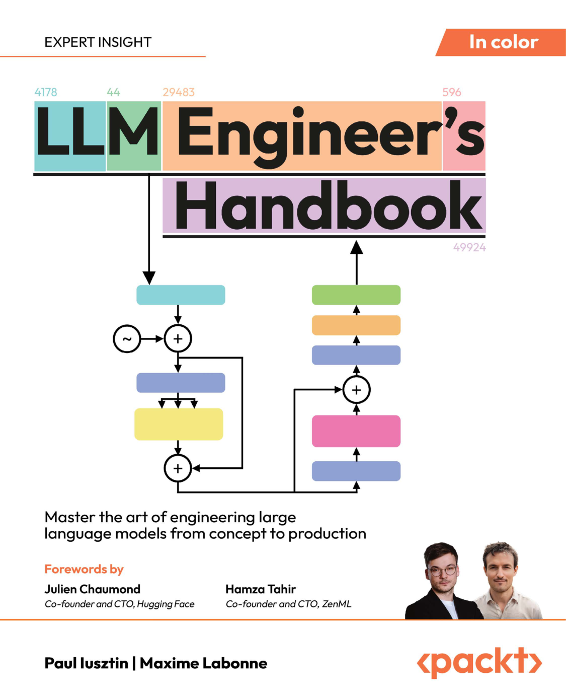

# Good Books

## Computer

### [1.llm-engineers-handbook-engineering-production](http://xhrong.github.io/attachments/books/llm-engineers-handbook-engineering-production.pdf)
 
   📅 2024-03-15 | 🏷️ LLM  

   

   ▶️ 简介：XXX

---

### [1.Python高级设计模式实践](http://xhrong.github.io/attachments/execution.pdf)

   📅 2024-03-12 | 🏷️ Rust, 并发  

    

   ▶️ 通过实战案例演示如何构建安全的并发系统...

---

## Education

### [1.Python高级设计模式实践](https://www.baiduc.com)

   📅 2024-03-12 | 🏷️ Rust, 并发  

    

   ▶️ 通过实战案例演示如何构建安全的并发系统...

---

## Others

### [1.Python高级设计模式实践](https://www.baiduc.com)

   📅 2024-03-12 | 🏷️ Rust, 并发  

    

   ▶️ 通过实战案例演示如何构建安全的并发系统...

---