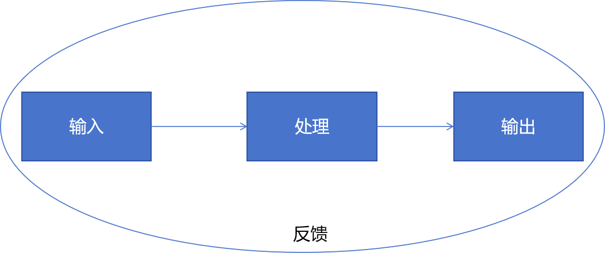

### 一、基本学习模型

从基本模型上看，学习可以简化成如下模型。

具体来说：通过某种或某些种方式，将知识、技能、态度等输入到人脑中，进行记忆、理解、综合等处理，并通过语言、计算、操作等外化为输出，通过反馈动态监控和调整模型执行情况，以控制其向规划的方向发展。

### 二、语文知识框架

从语文学习和考试的角度来看，语文知识主要分为基础知识、阅读能力、写作能力三个方面。

- 基础知识，包括拼音、字、词、句、古诗文、文学常识、文学理论等，内部以点状存在，逻辑性和关联性较弱，主要通过长期积累日渐丰富，是长期的输入。

- 阅读能力，包括文章理解、古诗文鉴赏等，即是输入，也是输出，是语文学习的主要目标之一。

- 写作能力，主要是指作文写作，是综合性输出。检验语文学习最全面深入的方式。

其它还有口头表达、态度培养等也是语文学习的内容，但一般不会在考试上重点体现。

### 三、语文学习策略

#### 1、基础知识
基础知识需要长期的坚持和积累，没有捷径可走。推荐两个操作性较好的方法，可为基础知识的学习提供一定的抓手。

1、积累本。可以分类对以下知识内容进行记录，以便将学习可追踪。
- 字：拼音、重点字、难字、错字、形近字、同意字等
- 词：好词、成语、组词、近义词、反义词等
- 句：好句、习语、名人名言、古诗文好名等
- 文学常识：名著
- 文学理论： 修辞、表现手法、写作手法等

2、背诵。背诵是最直接的输入，只能背诵才能将输出转化为个人知识。背诵包括记忆、理解、书写等方面，不是口水账式的死记硬背。

#### 2、阅读

#### （1）两个技巧

- 答题原则：一切从文中来，引申要有原文依据
- 主观题答题模板：采用XX艺术手法（表达方式 或 修辞手法 或表现方式），写出了XX（特征 或 事件），表达xx（思想 或 情感）

#### （2）文章基础知识

- 体裁：记叙文、说明文、议论文、寓言、童话、现代诗、古诗文

- 表达方式：叙述、描写、抒情、议论和说明

        记叙：记叙人物的经历或事情的发生、发展、变化过程。一般用于叙事诗的表达，以高中课本中《琵琶行》和《孔雀东南飞》为代表，而律诗和绝句当中也有出现，如：杜甫的《登岳阳楼》：“昔闻洞庭水，今上岳阳楼。”

        描写：用生动形象的语言对人物、事件、环境所作的具体描绘和刻画。如：《孔雀东南飞》中对刘兰芝的描写：“足下蹑丝履，头上玳瑁光。腰若流纨素，耳著明月珰。指如削葱根，口如含朱丹。”其中白描是诗歌鉴赏中常见的一种表现手法。

        议论：对人和事物的好坏、是非、价值、特点、作用等所表示的意见。例如：秦观的《鹊桥仙》中：“两情若是久长时，又岂在朝朝暮暮？”柳永的《雨霖铃》：“多情自古伤离别，更哪堪冷落清秋节？”

        抒情：表达作者强烈的爱憎、好恶、喜怒、哀乐等主观感情。（抒情，有直接抒情，也有间接抒情。间接抒情在诗歌鉴赏中一般表现为借景抒情、情景交融、乐景哀情、托物言志等，而这一般又称之为表现手法）

        说明：

- 修辞手法：**比喻**，比拟(分为**拟人**、拟物)，叠字，顶真(又名顶针、联珠)，**对比**，对偶(对仗、队仗、排偶)，反复，**反问**，**反语**，互文，**借代**，**设问**，**排比**，列锦，**夸张**，**双关**，**通感(移觉、移就)**，用典，**衬托(反衬、陪衬)**，倒装，**引用**，谐音，歇后，象征，回文，飞白，呼告。

- 表现手法：或表达技巧，凡是能使文章整体或部分产生鲜明强烈的印象，达到感染读者的艺术效果的手段或方法，都可视为表现手法。主要着眼于使文章的整体或部分产生效果。常见的表现手法有：赋、比、兴、烘托、象征、用典、白描、蒙太奇、托物言志、借景抒情、心理刻画、寓庄于谐、联想和想象，等等

        抒情散文的表现手法有：借景抒情、托物言志、抑扬结合、 象征等手法。
        
        记叙文的写作手法有：如首尾照应、画龙点睛、巧用修辞、详略得当、叙议结合、正侧相映等。

        议论文写作手法有：如引经据典、巧譬善喻、逆向求异、正反对比、类比推理等。

        小说的表现手法有：描写手法、衬托（烘托）手法、伏笔和照应、悬念和释念、实写与虚写等。

        诗歌的表现手法有：赋比兴、用典、衬托、渲染、象征、对比、先抑后扬、先扬后抑、动静结合、虚实结合等。
        
        说明文表现手法有：分类说明、顺序说明、总分变换、递进因果、比拟等。
    常见表现手法及其作用：

        联想、想象：联想由一事物联系到与之有关的另一事物，或把事物中类似的特点联系起来造成一个典型。想象是人们在已有材料和观念基础上，经过联想、推断、分析、综合，创造出新的观念的思维过程。作用是丰富文章内容，使人物形象更丰满、生动，性格更鲜明突出，情节更生动感人，增添艺术感染力。

        铺垫：为主要情节做准备或酝酿高潮到来之前的一系列非主情节。它可以显示情节发展的必然性，增强作品的感染力和说服力；可以制造悬念，引起读者的兴趣和关注。

        象征：通过特定的、容易引起联想的具体形象，表现与之相似或相近特点的概念、思想和感情。作用首先是它把抽象的事理表现为具体的可感知的形象，使文章更含蓄些，运用眼前之物，寄托深远之意，耐人寻味。

        对比（对照 ）：把两种不同的事物或情形作对照，互相比较。作用是突显对象的特点，使形象更加鲜明。

        衬托（烘托）：指的是以乙托甲，使甲的特点或特质更加突出。有正衬和反衬两种。作用是突出本体的某个特征。

        抑扬：把要贬抑否定的方面和要肯定的方面同时说出来，只突出强调其中一个方面以达到抑此扬彼或抑彼扬此的目的。有先扬后抑和先抑后扬之分。

        （前后）照应：指诗中对前面所写的作必要的回答。恰当运用这种方法使结构显得紧凑、严谨。作用：内容前后照应，情节严丝合缝。

        正侧描写：对描写对象进行正面的直接的描写是正面描写；描写对象周围的事物，使对象更鲜明、突出的是侧面描写。作用：直接和间接描写方法结合运用，可以使被描写的人物或景物的特点更加鲜明、突出。

        虚实结合：是指现实的景、事与想象的景、事互相映衬，以实衬虚、以虚衬实，交织一 起表达同样的情感。作用是鲜明的刻画人物的性格，凸现事物、景物的特点，突出主旨。

        托物言志：在描摹事物以尽其妙的基础上融入作者的感情，含蓄地寄托作者的主张、哲理，能给人留下思考的余地和想象的空间。

        直抒胸臆：直接表达诗人面对自然景象所产生的情感和富有哲理性的思想。

        借景抒情：通过景物描写，衬托作者或喜或悲的情感。

        融情于景：人要表达的思想感情正面不着一字，全然寓于眼前的自然景象之中，借自然 景物抒发感情。

        衬托或渲染：对环境、景物作多方面的描写形容，以突出事物的特点，营造氛围。

        动静结合：对事物、景物作动态、静态的描写，两者相互映衬，构成一种情趣。

        以静衬动：突出了事物的动态（热闹、灵活、敏捷等）特征。

        以动衬静：突出环境静谧、安静、寂静的特点。

        用典：用典有用事和引用前人诗句两种。用事是借用历史故事来表达作者的思想感情，包括对现实生活中某些问题的立场和态度、个人的意绪和愿望等等，属于借古抒怀。委婉地表达了作者的思想、情感。

        白描：不用华丽的辞藻，用最经济、最俭省的笔墨勾勒鲜明生动的形象。寥寥几笔就能起到突出事物神韵的效果。

        开门见山：文章开头直入正题，不拐弯抹角。

        点面结合：叙写事件全过程是面，抓住某个特殊情节或细节是点，二者结合能反映出事物的全貌，又能突出重点，表达事件的普遍意义和特殊意义。

        以小见大：抓住最能体现大主题、看似平凡细小却包含典型意义和生活哲理的小事件来叙写。感人且具有社会意义。

        悬念：在情节发展中设置某种疑端或矛盾冲突，使人产生关心事物发展或人物命运的心理活动，引人入胜。

        伏笔：对作品中将要出现的人物或事件在不大引人注意的地方预先作出暗示或提示，到适合的实际给予呼应，以收到前后连贯、结构严谨的效果

#### 写作

to be continue

### 总结
to be continue

### 参考

https://mp.weixin.qq.com/s?__biz=MzU1NTM4Njk0OQ==&mid=2247601561&idx=4&sn=0c85b76eadac0f48d0a2700fc5b3a202&chksm=faf943e60615402aa2e06715a3e6dc382a1ad448f3c7e95f15acb5ad8578e11a013cbc7b96f6&scene=27